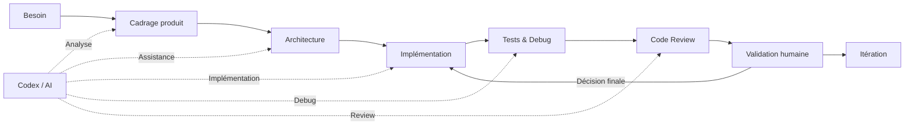

# Maël Kahilu

<div align="center">


<br />

**Développeur produit · Web & Mobile · Full-stack · Agentic Engineering**

Basé à Lubumbashi, je transforme des besoins concrets en produits numériques fiables,
en reliant **vision produit, développement et ingénierie assistée par IA**.

<br />

`4 ans d'expérience` · `15+ projets réalisés` · `14 technologies utilisées`

</div>

---

## À propos

Je ne vois pas le développement comme une simple succession de fonctionnalités.

J’aime partir d’un besoin réel, comprendre son contexte, simplifier le problème puis construire une solution claire, maintenable et capable d’évoluer.

Mon travail se situe généralement à l’intersection de quatre dimensions :

```txt
PRODUCT       Comprendre le besoin et définir ce qui mérite réellement d'être construit.
ENGINEERING   Transformer cette vision en architecture et en code fiables.
EXPERIENCE    Garder l'interface lisible, cohérente et agréable à utiliser.
AI            Utiliser l'intelligence artificielle comme accélérateur d'ingénierie.
```

---

## Stack

<div align="center">


<br />


<br />


<br />


</div>

---

## Ce sur quoi je me concentre

<table>
<tr>
<td width="50%" valign="top">

### BUILD

**Web full-stack · Mobile · SaaS · Outils métier**

Transformer un besoin en produit utilisable, avec une attention particulière portée à la structure, à l'interface et à l'évolution du produit.

</td>
<td width="50%" valign="top">

### THINK

**Produit · UX · Architecture · Business**

Comprendre ce qui mérite réellement d'être construit avant de choisir comment le construire.

</td>
</tr>

<tr>
<td width="50%" valign="top">

### SHARPEN

**Next.js · TypeScript · Backend · PostgreSQL · Security**

Approfondir mon ingénierie pour construire des systèmes plus fiables, maintenables et proches de la production.

</td>
<td width="50%" valign="top">

### EXPLORE

**Agentic Engineering · Automatisation · IA**

Explorer comment l'IA peut augmenter les capacités d'un développeur sans remplacer sa responsabilité technique.

</td>
</tr>
</table>

## Engineering × AI

Je considère l'IA comme une couche supplémentaire dans mon environnement d'ingénierie : elle accélère l'analyse, l'implémentation et la vérification, mais ne remplace pas la décision technique.



<table>
<tr>
<td align="center"><strong>AI</strong><br/><sub>Analyse · Génération · Review · Debug</sub></td>
<td align="center">→</td>
<td align="center"><strong>Developer</strong><br/><sub>Architecture · Décisions · Validation</sub></td>
<td align="center">→</td>
<td align="center"><strong>Product</strong><br/><sub>Fiable · Utile · Maintenable</sub></td>
</tr>
</table>

## Manière de travailler

|  | Principe | Application |
|---|---|---|
| `01` | **Clarté avant complexité** | Une solution compréhensible vaut mieux qu'une architecture impressionnante mais inutile. |
| `02` | **Structure avant accumulation** | Chaque nouvelle fonctionnalité doit avoir une place logique dans le produit. |
| `03` | **Usage avant fonctionnalité** | Je construis à partir du besoin utilisateur, pas à partir d'une liste de features. |
| `04` | **Fiabilité avant vitesse apparente** | Tests, validation et maintenabilité font partie du développement. |
| `05` | **Évolution plutôt que réécriture** | Une bonne base doit pouvoir grandir sans être reconstruite en permanence. |

## Collaboration

Je peux intervenir sur un produit existant ou accompagner la construction d’une première version exploitable.

`Produit web full-stack` · `React Native` · `Prototype produit` · `Workflow agentique` · `Renfort technique`

Je travaille volontiers avec des développeurs, designers ou porteurs de projet lorsque l’objectif est de transformer une idée en produit clair, crédible et maintenable.

---

## GitHub activity

<div align="center">


<br />
<br />


<br />
<br />


</div>

---

<div align="center">

### Ligne directrice

**Comprendre avant de construire.**
**Structurer avant d’ajouter.**
**Améliorer avant de multiplier.**
**Livrer utile avant de chercher l’impressionnant.**

</div>

---

## Me retrouver

<div align="center">

<a href="https://maeldev.qzz.io/">
  
</a>

<a href="https://github.com/Sombre-mael">
  
</a>

<a href="mailto:sombremael@gmail.com">
  
</a>

</div>

<br />

<div align="center">

`Product` × `Engineering` × `AI`

</div>
